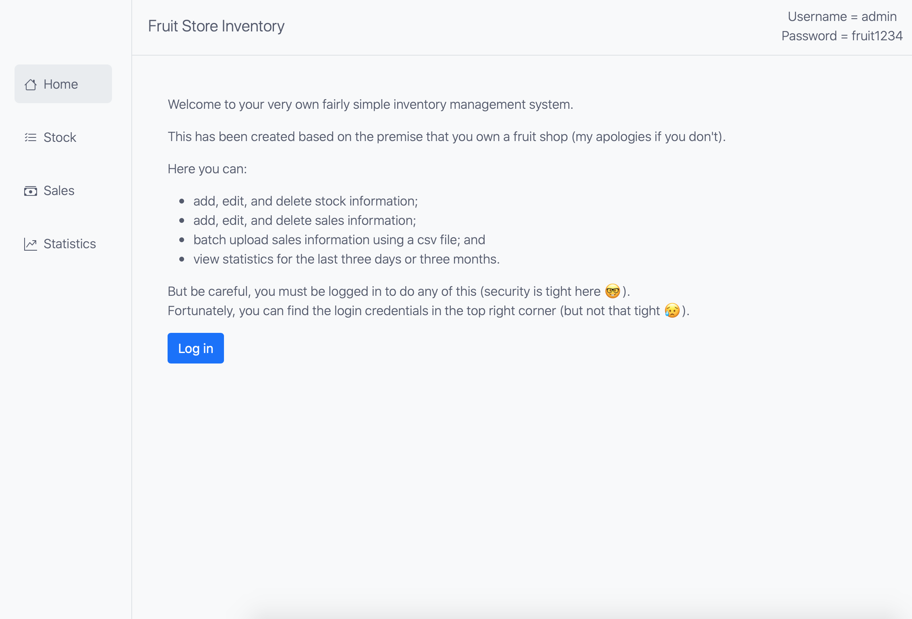
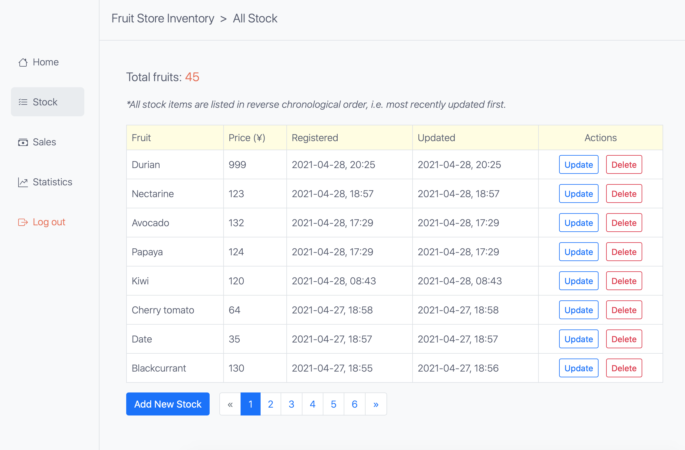
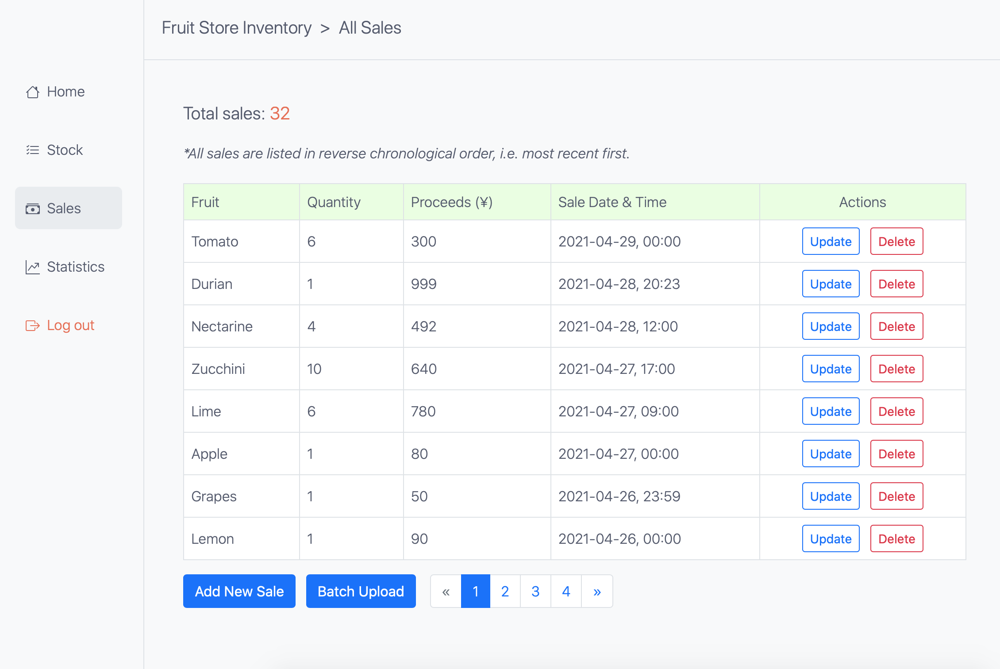
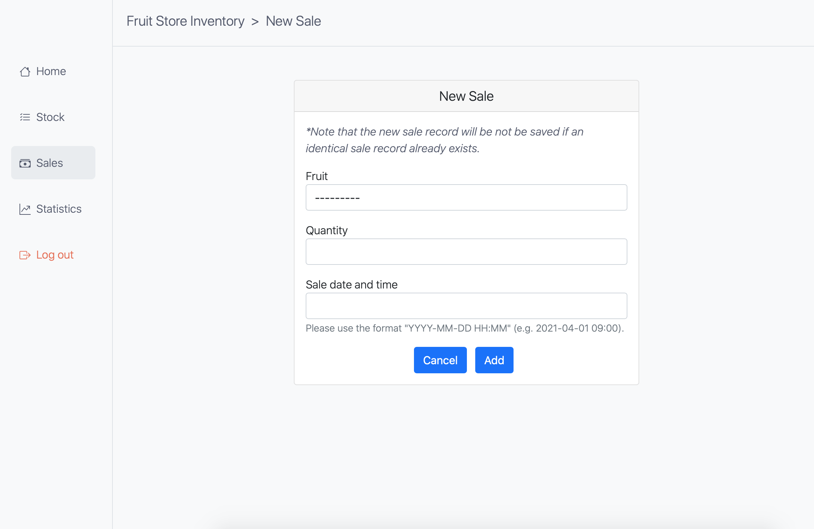
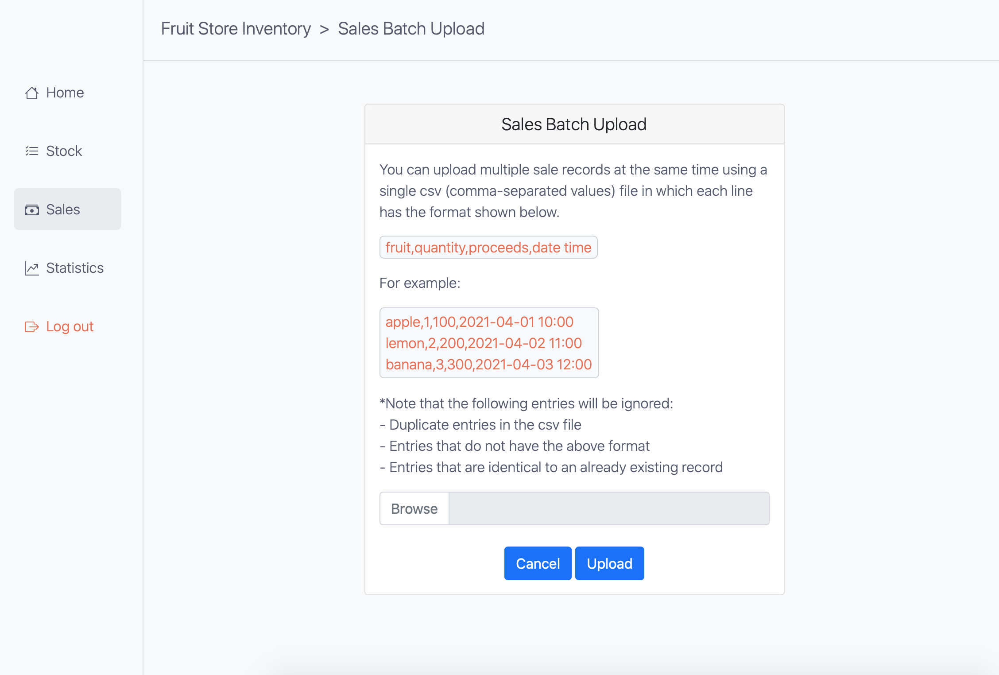

# simple_inventory

[Live demo](https://jjl-simple-inventory.herokuapp.com)

## To run
* Clone this repo into a location of your choosing. 
`git clone https://github.com/4ka0/simple_inventory.git`
* Move into the project folder. 
`cd simple_inventory`
* Activate a virtual environment 
(Example using venv:) 
`python3 -m venv venv` 
`source venv/bin/activate`
* Install the dependencies. 
`pip install -r requirements.txt`
* Run the tests. 
`python manage.py test`
* Run the local server. 
`python manage.py runserver`
* Access "localhost:8000" in your browser. 
* Go to the home page and log in. 

* The project directory contains a file called "sales_data.csv" that can be used for bulk uploading of test sales information.

### Built using:

* Python 3.7.9
* Django 3.1.7
* Bootstrap 4
* Black 20.8b1
* Doverage 5.5
* django-crispy-forms 1.11.1
* Environs 9.3.2
* Freezegun 1.1.0
* Python-dateutil 2.8.1
* Visual Studio Code 1.55.2

### Screenshots:

Home page: 
 

Stock list: 
 

Sale list: 
 

Sale create: 
 

Sale upload: 
 

Statistics: 
 
